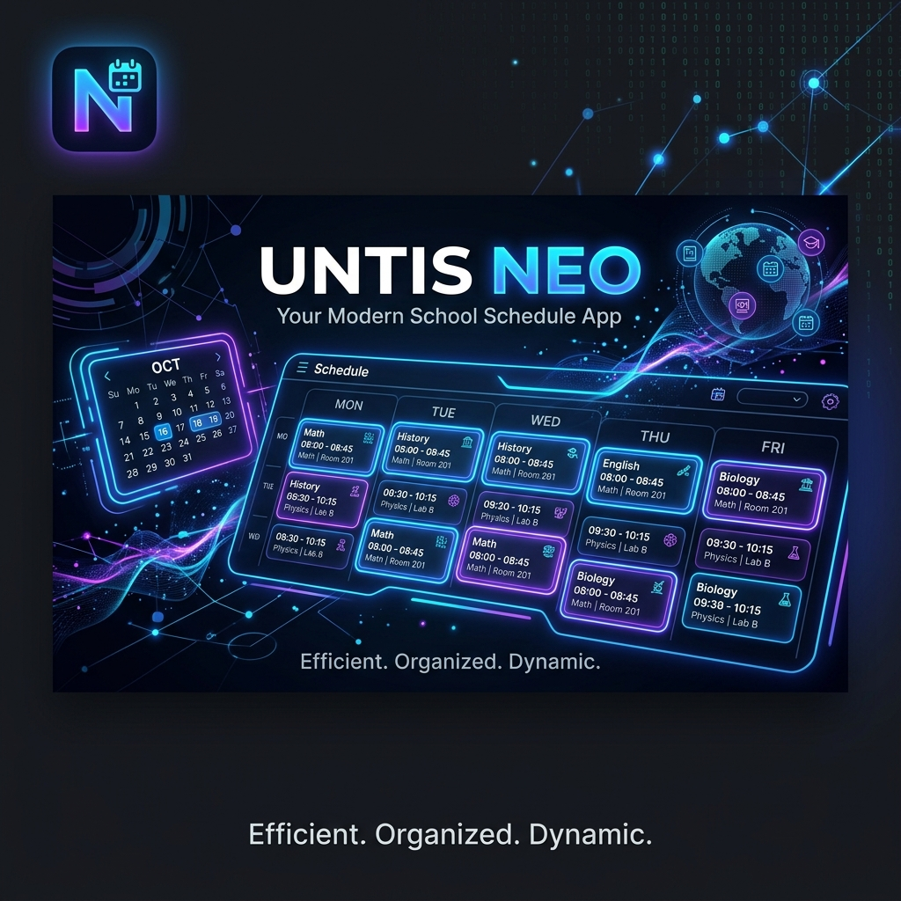

  

# Untis Neo 🚀

> Ein moderner, inoffizieller und erneuerter Client für WebUntis.

**Untis Neo** (Untis Mobile Renew) ist ein Android-Projekt, das eine neue und verbesserte Benutzeroberfläche für das Schulverwaltungs- und Stundenplan-System WebUntis bietet. Gebaut mit modernen Android-Technologien, liefert Untis Neo eine flüssige, aufgeräumte und visuell ansprechende Erfahrung für Schüler und Lehrer.

## Neu in UntisNeo
- **LoRa Meshtastic Integration**: Chatte mit deinen Mitschülern komplett offline über das P2P-Radar! Unterstützt Heltec-LoRa-Module (via Intent-Broadcast an die offizielle Meshtastic App).
- **KI Chatbot (Gemini)**: Fotografiere eine Hausaufgabe und Gemini analysiert und trägt sie für dich ein.

## ✨ Features

- 📱 **Modernes Design**: Intuitive UI mit Jetpack Compose, inklusive flüssigen Animationen und Dark-Mode-Support.
- ⚡ **Schnell & Effizient**: Optimierte Kommunikation mit der WebUntis JSON-RPC API für blitzschnelle Ladezeiten.
- 📅 **Übersichtlicher Stundenplan**: Alle Fächer, Vertretungen und Räume auf einen Blick im Kalender.
- 🔒 **Datenschutz im Fokus**: Direkte Kommunikation mit den Untis-Servern.

## 🚀 Installation & Lokale Ausführung

**Voraussetzungen:** [Android Studio](https://developer.android.com/studio)

1. **Projekt klonen / öffnen**
   Öffne Android Studio, wähle **Open** und wähle dieses Projektverzeichnis aus.
2. **Abhängigkeiten synchronisieren**
   Erlaube Android Studio, das Projekt einzurichten und alle nötigen Gradle-Dependencies herunterzuladen.
3. **Umgebung konfigurieren**
   Erstelle eine `.env`-Datei im Root-Verzeichnis, falls nötig (siehe `.env.example`).
4. **App ausführen**
   Wähle deinen Emulator oder ein physisches Gerät aus und klicke auf **Run** (oder `Shift + F10`), um Untis Neo zu starten.

## 🛠️ Technologie-Stack

- **Sprache**: Kotlin
- **UI Framework**: Jetpack Compose
- **Architektur**: MVVM (Model-View-ViewModel)
- **Netzwerk**: Retrofit, OkHttp, Moshi (JSON-RPC)
- **Asynchronität**: Kotlin Coroutines & Flow

## 🤝 Mitwirken

Pull Requests und Issues sind herzlich willkommen. Wenn du neue Features vorschlagen oder Fehler melden möchtest, eröffne gerne ein neues Issue.

---
*Hinweis: Dies ist ein inoffizielles Community-Projekt. Es steht in keiner offiziellen Verbindung zur Untis GmbH.*